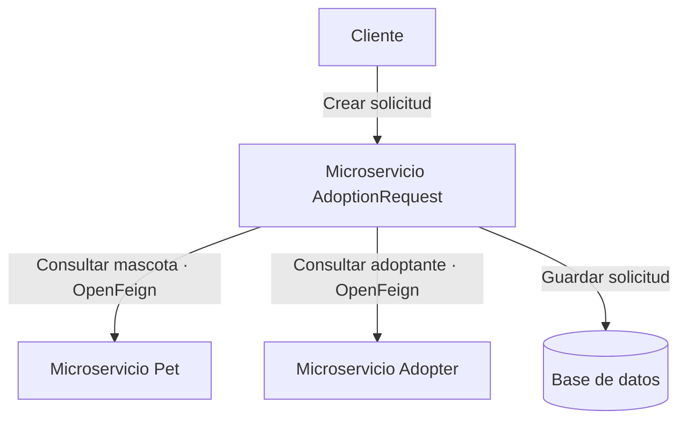

# Microservicio de Solicitudes de Adopción

Este microservicio representa la administración de solicitudes de adopción dentro del sistema.

La entidad principal será `AdoptionRequest`, la cual almacena la información necesaria para registrar qué adoptante desea adoptar una mascota.

---

## Entidad: AdoptionRequest

La entidad `AdoptionRequest` representa una solicitud realizada por un adoptante para iniciar el proceso de adopción de una mascota.

Este microservicio se comunica con:

- Microservicio de mascotas.
- Microservicio de adoptantes.

---




## Atributos sugeridos

- id
- adopterId
- petId
- emailAdopter
- namePet
- status

---

## Enum sugerido: AdoptionRequestStatus

El estado de la solicitud puede manejarse mediante un enum.

```java
public enum AdoptionRequestStatus {
    PENDING,
    APPROVED,
    REJECTED
}