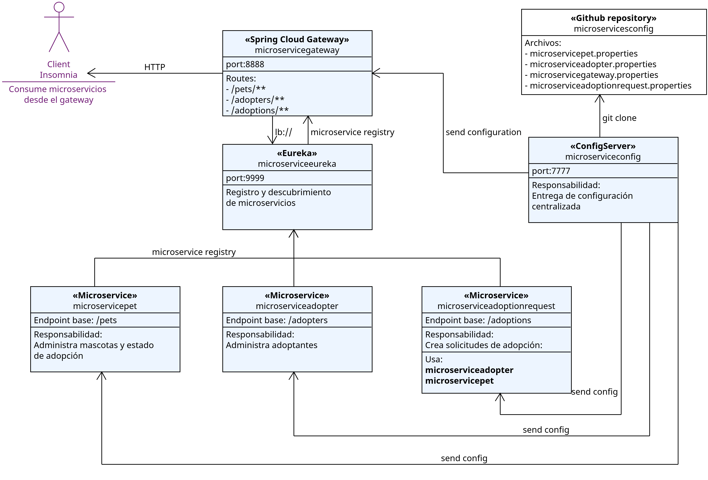

# Adopta Pet
Sistema de adopción de mascotas desarrollado con una arquitectura de microservicios usando **Spring Boot** y **Spring Cloud**.

El proyecto tiene como objetivo mostrar una arquitectura distribuida compuesta por microservicios de negocio, servicios de infraestructura, descubrimiento de servicios, gateway, configuración centralizada, comunicación entre servicios.

---

## Descripción general

**AdoptaPet** permite administrar un flujo básico de adopción de mascotas.

El sistema está compuesto por tres microservicios principales:

- Administración de mascotas.
- Administración de adoptantes.
- Administración de solicitudes de adopción.

Además, incluye servicios de infraestructura para:

- Descubrimiento de servicios con Eureka.
- Entrada centralizada con Spring Cloud Gateway.
- Configuración centralizada con Spring Cloud Config.
- Comunicación entre microservicios con OpenFeign.

---

